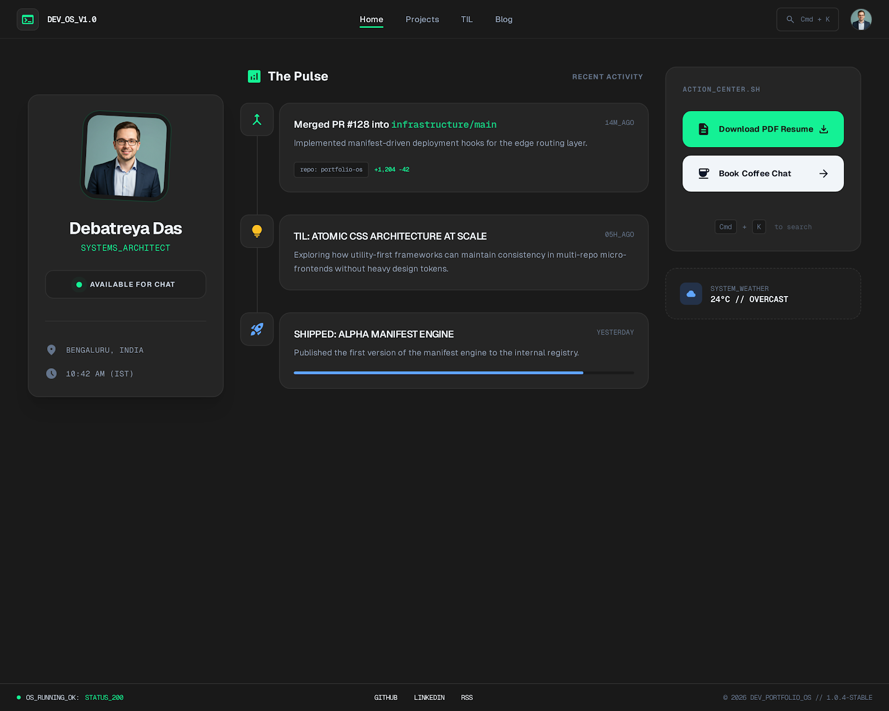
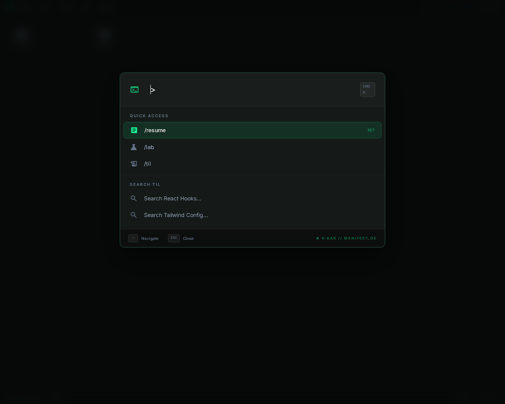
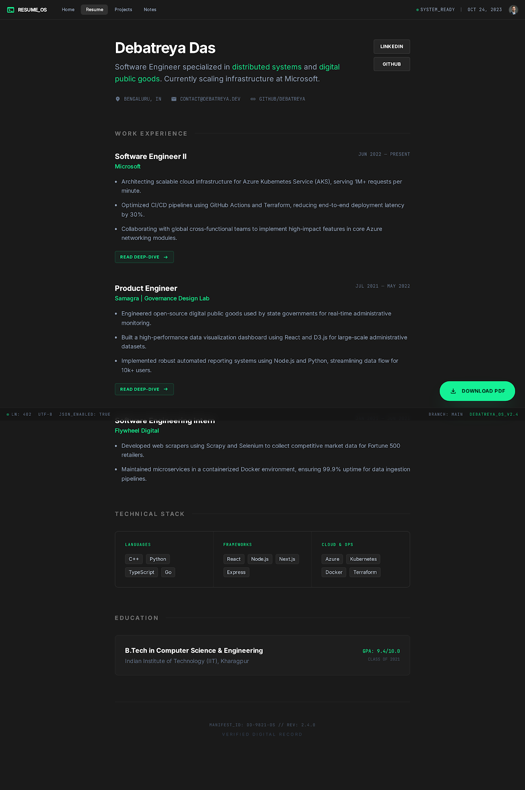
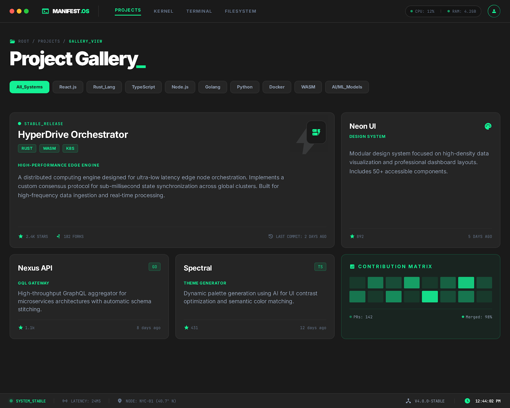
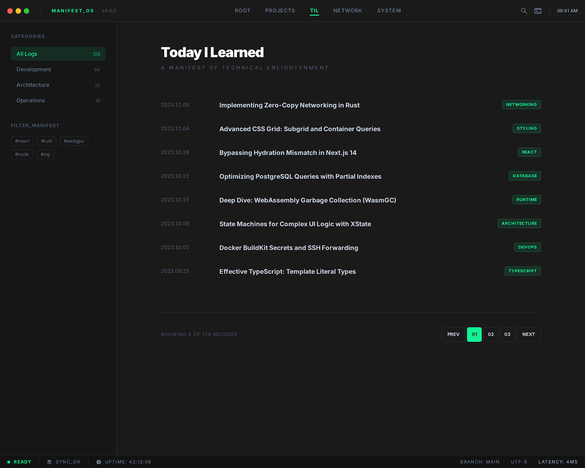
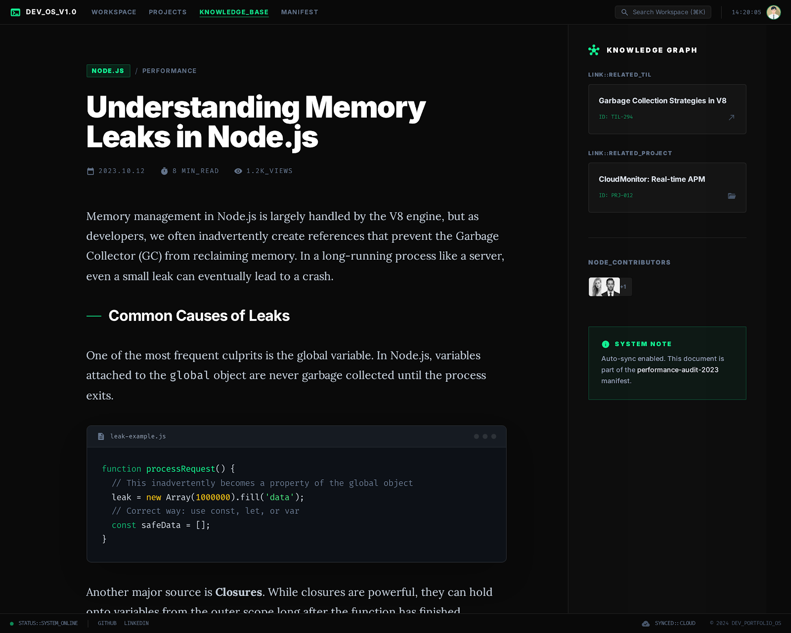
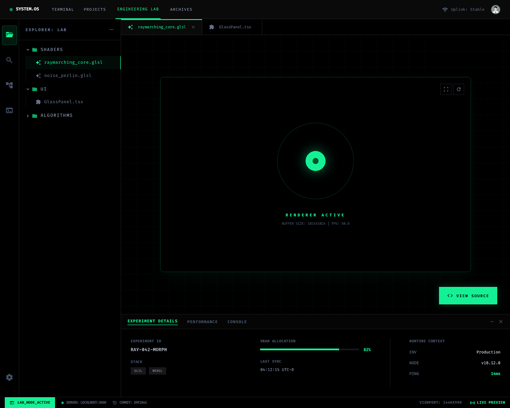

## 1. The Home Dashboard (`/`)

> **Intent:** A "Mission Control" center that feels like a developer's OS. High-density information with a focus on active pulses (availability and live work).

**The Stitch Prompt:**
"Design a 3-column dashboard for a developer portfolio.

* **The aesthetic:** Deep charcoal background, minimalist bento-box cards with subtle borders.
* **Column 1 (Identity):** A compact sidebar featuring a profile picture, name 'Debatreya Das', and a 'Live Status' component with a green pulsating dot labeled 'Available for Chat'. Include location and local time.
* **Column 2 (The Pulse):** A vertical feed of 'Recent Activity'. Use a chronological timeline style to show GitHub PRs (repo name + PR title) and the latest TIL (Today I Learned) post titles.
* **Column 3 (Actions):** A stack of high-contrast action buttons: 'Download PDF Resume' and 'Book Coffee Chat'. At the bottom, a subtle hint text `[Cmd + K] to search`.
* **Mobile Behavior:** Collapse into a single vertical column with Identity at the top, Actions in the middle, and Activity Feed at the bottom."

---

## 2. The Professional Resume (`/resume`)

> **Intent:** A clean, web-based version of your `resume.json` that mirrors the professional quality of your PDF but adds interactivity.

**The Stitch Prompt:**
"Create a professional, structured resume page based on a JSON data contract.

* **Header:** Large, clear name and contact info with links to GitHub/LinkedIn.
* **Layout:** Use a classic single-column layout with clear section headers (Experience, Education, Skills).
* **Experience Cards:** For each role (Microsoft, Samagra, Flywheel), display the company, role, dates, and bullet points. If a role has a 'slug', add a subtle 'Read Deep-Dive' button that matches the accent color.
* **Skills Grid:** Organize skills into categorized pill tags (Languages, Frameworks, Tools).
* **Floating Action:** A sticky 'Download PDF' button should follow the user on the bottom-right of the screen. Ensure the typography is highly readable with optimized line-height for long-form reading."

---

## 3. The Project Gallery (`/projects`)

> **Intent:** A visual catalog of your repositories, driven by the `.debatreya` manifest.

**The Stitch Prompt:**
"Design a project gallery using a responsive grid layout.

* **Card Design:** Each project should be a card with a 'lift' effect on hover.
* **Header:** Display project name and 2-3 small technology icons (React, Rust, etc.).
* **Body:** A short tagline followed by the main description.
* **Footer:** A minimalist status bar showing real-time GitHub stats (Stars count and 'Last commit: X days ago').
* **Filtering:** Include a horizontal scrollable list of technology tags at the top to filter projects (e.g., 'React', 'Node', 'AI')."

---

## 4. The Knowledge Base (`/til` & `/blog`)

> **Intent:** A minimalist reading environment for your technical thoughts and TILs.

**The Stitch Prompt:**
"Design a minimalist technical writing index and reading page.

* **Index View:** A list of posts with the date, title, and a small category tag. No images—focus on clean typography.
* **Article View:** A centered, narrow text column for readability. Use a serif font for the body text if possible.
* **Sidebar:** A 'Knowledge Graph' sidebar that suggests related projects or TILs based on shared tags.
* **Code Blocks:** Ensure code snippets have a dark, high-contrast theme (like Monokai or VS Code Dark) with a copy button."

---

## 5. The Lab (`/lab`)

> **Intent:** A terminal-inspired playground for technical experiments.

**The Stitch Prompt:**
"Create an 'Engineering Lab' interface that mimics a code editor.

* **Sidebar:** A collapsible file-tree navigation showing different experiment categories (Shaders, UI, Algorithms).
* **Main Viewport:** A large canvas area to render the interactive React component.
* **Controls:** A bottom drawer or side panel with a 'View Source' toggle and 'Experiment Details' metadata.
* **Theme:** Darker than the rest of the site, using a true black background and monospaced fonts for all UI labels."

---
